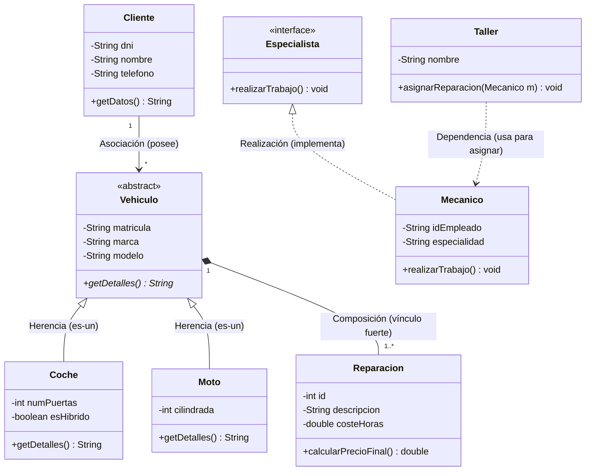

Documento de Diseño Técnico (DESIGN.md)

Este documento detalla la arquitectura de software y los patrones de diseño aplicados en el **Sistema de Gestión de un Taller de Vehículos**. Se centra en la estructura de clases y la semántica de sus relaciones.

1. Diagrama de Clases UML

El siguiente diagrama representa la estructura estática del sistema, utilizando la sintaxis de Mermaid para garantizar la compatibilidad con el entorno de desarrollo.

2. Análisis de Relaciones UML

2.1. Herencia y Abstracción (`Vehiculo`, `Coche`, `Moto`)
Se utiliza una **Clase Abstracta** `Vehiculo` para definir los atributos comunes. Esto impide la creación de vehículos "genéricos" y obliga a que cada vehículo sea una especialización concreta (`Coche` o `Moto`), cumpliendo con el principio de jerarquía de la POO.

2.2. Composición (`Vehiculo` -> `Reparacion`)
Representada por el rombo relleno. Indica una relación de **paternidad total**:
- Una `Reparacion` no puede existir sin un `Vehiculo`.
- Técnicamente, la lista de reparaciones reside dentro del objeto `Vehiculo`. 
- Si el objeto `Vehiculo` es destruido, la recolección de basura (GC) eliminará también todas sus `Reparaciones`.

2.3. Realización (`Especialista` <- `Mecanico`)
El uso de una **Interfaz** define un contrato. Esto permite que el sistema crezca; si en el futuro se añade un `Inspector` o un `Administrador` que también deban realizar tareas, solo tendrán que implementar `Especialista`, permitiendo al `Taller` tratarlos de forma polimórfica.

2.4. Asociación (`Cliente` -> `Vehiculo`)
Es una relación estructural simple. Un cliente posee vehículos, pero ambos objetos tienen ciclos de vida independientes. Si un cliente se borra, el vehículo podría ser transferido a otro cliente sin ser destruido.

2.5. Dependencia (`Taller` -> `Mecanico`)
Es la relación más débil (flecha discontinua). Indica que la clase `Taller` utiliza a la clase `Mecanico` únicamente como parámetro en un método (`asignarReparacion`), no manteniendo una referencia permanente como atributo de clase.

3. Principios de Diseño Aplicados

- **Encapsulamiento**: Todos los atributos están definidos como privados (`-`) para proteger el estado interno de los objetos.
- **Polimorfismo**: Mediante la interfaz `Especialista` y el método abstracto `getDetalles()`.
- **Mantenibilidad**: Estructura modular que permite cambios en la lógica de `Reparacion` sin afectar a la clase `Cliente`.

---
**Documento Relacionado:** [README.md](README.md)
