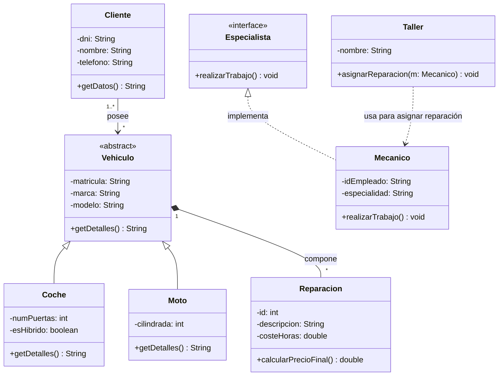

Sistema de Gestión de un Taller de Vehículos – Actividad 6.3

Este proyecto consiste en el desarrollo de una aplicación para la gestión integral de un taller mecánico, permitiendo administrar clientes, vehículos y reparaciones de forma eficiente utilizando los principios de la Programación Orientada a Objetos (POO).

Fase 1: Diseño – Diagrama UML (Mermaid)

A continuación se presenta el diseño de clases que servirá de base para la implementación. Este diseño cumple con los criterios de los Resultados de Aprendizaje (RA5.a, RA5.b, RA5.d) relacionados con la arquitectura y diseño de software.



Fase 2: Ingeniería Directa – Estructura Java 

En este apartado se muestra el esqueleto de las clases resultantes del proceso de ingeniería directa, respetando fielmente las relaciones y la visibilidad definidas en el diagrama UML.

Interfaz Especialista
```java
public interface Especialista {
    void realizarTrabajo();
}
```

Clase Cliente
```java
public class Cliente {
    private String dni;
    private String nombre;
    private String telefono;
    private List<Vehiculo> vehiculos;

    public String getDatos() { return ""; }
}
```

Clases de Vehículo 
```java
public abstract class Vehiculo {
    private String matricula;
    private String marca;
    private String modelo;
    private List<Reparacion> reparaciones; // Composición

    public abstract String getDetalles();
}

public class Coche extends Vehiculo {
    private int numPuertas;
    private boolean esHibrido;

    @Override
    public String getDetalles() { return ""; }
}

public class Moto extends Vehiculo {
    private int cilindrada;

    @Override
    public String getDetalles() { return ""; }
}
```

Clase Reparación 
```java
public class Reparacion {
    private int id;
    private String descripcion;
    private double costeHoras;

    public double calcularPrecioFinal() { return 0.0; }
}
```

Clase Mecánico 
```java
public class Mecanico implements Especialista {
    private String idEmpleado;
    private String especialidad;

    @Override
    public void realizarTrabajo() { }
}
```

Clase Taller 
```java
public class Taller {
    private String nombre;

    // Dependencia: usa puntualmente un Mecanico
    public void asignarReparacion(Mecanico m) { }
}
```

Fase 3: Interpretación del Diseño

En esta fase se justifica la toma de decisiones técnicas realizadas durante el diseño del sistema, asegurando la robustez y escalabilidad de la solución.

Composición entre Vehiculo y Reparación
Se ha optado por una relación de **composición** (vínculo fuerte) porque la existencia de una `Reparacion` no tiene sentido sin un `Vehiculo` asociado. Técnicamente, esto implica que:
- El ciclo de vida de los objetos `Reparacion` está ligado al del `Vehiculo`.
- Si un vehículo se elimina del sistema, sus reparaciones asociadas también desaparecen.
- Garantiza la integridad referencial de los datos, evitando "reparaciones huérfanas" en la base de datos o en memoria.

Ventajas de usar la interfaz Especialista
El uso de la interfaz `Especialista` por parte de la clase `Mecanico` aporta múltiples beneficios al diseño:
- **Polimorfismo**: El `Taller` puede interactuar con cualquier objeto que implemente `Especialista` sin conocer su clase concreta. Esto permitiría añadir en el futuro otros perfiles (ej. Electricista, Chapista) sin modificar la lógica de asignación.
- **Desacoplamiento**: Define un contrato de comportamiento (`realizarTrabajo`) que separa el "qué" hace un especialista del "cómo" lo hace cada tipo específico de profesional.
- **Mantenibilidad**: Facilita la extensión del sistema siguiendo el principio de "abierto a la extensión, cerrado a la modificación".

Fase 4: Ingeniería Inversa – Nueva Clase Factura (RA5.f)

En esta etapa del proyecto, se ha realizado un proceso de **ingeniería inversa** para reflejar cambios realizados directamente sobre la implementación en el diseño original.

Integración de la Clase Factura
Durante el desarrollo, se detectó la necesidad de gestionar el proceso de cobro, por lo que se procedió a implementar la clase `Factura` directamente en el código fuente Java. Esta clase se encarga de consolidar los datos de las reparaciones realizadas y generar el importe total a abonar por el cliente.

Actualización del Modelo de Diseño
Para mantener la coherencia entre el código y la documentación técnica, el siguiente paso consiste en actualizar el diagrama UML. Este proceso se realizará de forma automatizada:
1.  **Sincronización**: Se utilizará una herramienta de modelado (plugin de IDE o IA especializada) para analizar el bytecode o el código fuente actual.
2.  **Generación Automática**: El nuevo diagrama se generará automáticamente a partir de la estructura de clases real, asegurando que la nueva clase `Factura` y sus relaciones queden documentadas sin errores manuales.

---
**Curso:** 1º DAW - Programación
**Alumno:** [Dario Rumi]
**Actividad:** 6.3 - Sistemas de Gestión
